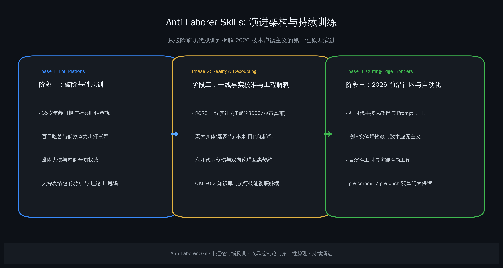
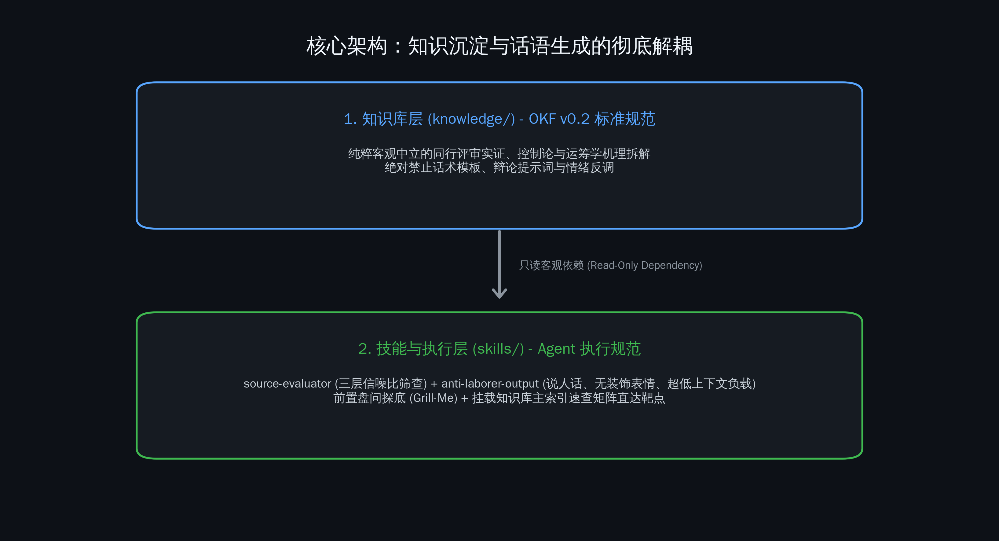

# 持续训练的反力工 skill

这个项目一开始并没有打算去网上跟人对线，更不是为了找个由头唱反调。

现实里大家应该都见过这种场景：有人跟你说“代码必须一行行手敲才有工匠灵魂，用 AI 就是偷懒”；或者反过来，有人觉得“既然有大模型，学什么编译原理和数据结构，天天无脑刷 Prompt 就完事了”。再往前推，还有“什么年龄做什么事，35 岁没定型就废了”、“吃得苦中苦方为人上人”、“敲键盘都是虚的，下苦力学门修车手艺才是真本事”。

这些话听多了，人容易累。如果你顺着对方的情绪去争，最后只能变成互扣帽子；如果你不回应，周围的氛围又会被这种机械劳作的惯性拖下去。

Anti-Laborer-Skills 想做的事其实很简单：**给 AI Agent 和我们自己，配一套基于控制论、运筹学和实证数据的客观工具，遇到力工思维时能直接降维解构，省下时间和算力去干正经事。**

## 演进的三步走

从最早的一堆零散笔记，到今天这套体系，中间大致走过了三个阶段：

### 1. 破除基础规训
最开始沉淀的，是针对几种最普遍的反智套话：
- 把局部制度门槛（比如考公 35 岁硬指标）误当成人体生理规律的“社会时钟论”；
- 把纯粹体力消耗和机械出汗神圣化的“受苦崇拜”；
- 一辩论就搬出“某某大厂几万工程师怎么可能想不到”的虚假全知权威；
- 加上中文网络里最常见的两套盾牌：感性上发一个 `[笑哭]` 展现假优越感，理性上挂一句“理论上可行”来双向甩锅。

### 2. 碰一碰 2026 年的一线真实
很多写文章的人习惯坐在书斋里脑补底层，结果写出来的东西脱离实际。

2026 年的真实情况是：工厂打螺丝月入 8000 以上已经很普遍，靠炒股真赚到钱的年轻人也不少。为什么他们还会沉迷在宏大叙事或者死板规训里？调查之后发现，很多人背着老一辈转嫁过来的婚房房贷与单向孝道枷锁，自尊在现实里被压碎，只能靠把自己寄托到宏大实体上获得心理代偿；还有年轻群体习惯拿“本来就该这样”当防御盾牌，这往往是因为还没经历过生产实践，只要真上班碰过真实社会，就会迅速脱敏回归理性。

搞清楚底层病理，回应才能切中要害，而不是居高临下地讲大道理。

### 3. 把知识和嘴皮子彻底拆开
很多人做 Prompt 库容易犯一个错：把事实证据、理论模型和回答话术全搅和在一起。这样不仅模型容易幻觉，回答也容易带着一股刻薄和说教味。

我们把仓库拆成了两层：
- **知识库层 (`knowledge/`)**：按 Google OKF v0.2 标准写，里面全是同行评审论文、法条对比、控制论方程和实证反例。这里面不允许有一句提示词，也不允许带任何情绪反调，只讲客观事实。
- **技能执行层 (`skills/`)**：比如 `source-evaluator` 负责用三层筛子过滤情绪谩骂与政治噪声；`anti-laborer-output` 负责按“说人话”的标准输出，不准带多余表情符号，压低上下文开销。下游生成话术时，知识库只是它的只读字典。

## 2026 年的前沿：新型力工长什么样？

力工思维不是一成不变的，随着技术升级，它也会长出新面孔：

1. **AI 时代的手搓原教旨与 Prompt 力工**：
   一方面有人把打字员的机械摩擦力当成“工匠灵魂”，抗拒自动化杠杆；另一方面有人彻底放弃对系统边界和并发状态机的理性思考，沦为无目的试错的 Prompt 祈祷工。两者的毛病一样：分不清什么是系统拓扑的本质复杂度，什么是敲键盘的偶然复杂度。
2. **物理实体拜物教与数字虚无主义**：
   觉得代码、算法和组织调度都是“看不见摸不着的虚空泡沫”，只有把物质从 A 点搬到 B 点才叫真劳动。这种看法完全无视了信息作为负熵对生产力的万倍放大效应。
3. **表演性工时与防御性伪工作**：
   管理层无法度量知识产出，就退化到抓工位时长；员工为了安全感，白天摸鱼晚上表演。深夜疲劳直接导致系统重大事故率飙升数倍，表面上越“敬业”，实质上对工程破坏越大。

## 怎么保证这套东西不跑偏？

光靠嘴上说保持客观没用，工程仓库得靠机械防线：
- **`pre-commit`**：强约束所有 Markdown 必须中英双语成对，`.gitignore` 必须用绝对路径，改动技能文件必须联动更新 README。
- **`pre-push`**：只要推送涉及知识库概念修改，钩子会自动检查双语主索引里的【言论症状与知识库靶点速查路由矩阵】以及 README 是否同步对齐。

持续训练不是为了把模型训练成杠精，而是给复杂世界留一份清醒、扎实的技术底稿。面对扑面而来的低信噪比杂音，我们不负责情绪抚慰，只提供不可辩驳的第一性原理。
